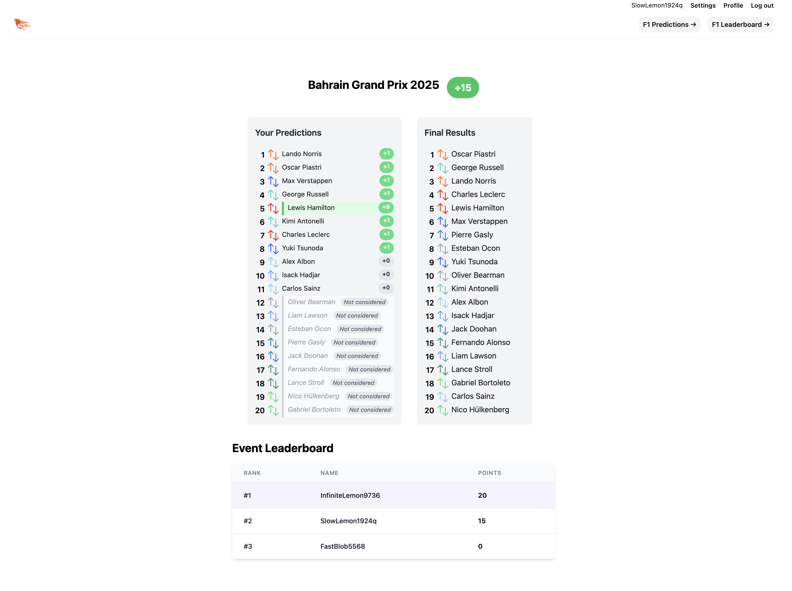

# Synapse - Prediction Platform

Synapse is a web application that allows users to make predictions for sporting events. Users can make predictions for an event, compete with friends on leaderboards, and track their performance across a season.

## Features

- **Formula 1 Predictions**: Currently implemented for predicting driver results
- **User Authentication**: Secure account creation and login system
- **Prediction System**: Make predictions for events before their deadlines
- **Auto Populate**: Pull season events and race results from [the jolpica api](https://github.com/jolpica/jolpica-f1)
- **Points Calculation**: Automatic scoring based on prediction accuracy
- **Leaderboards**: Track your performance against other users
- **Season Tracking**: View cumulative points across multiple events in a season
- **Admin Dashboard**: Manage seasons, events, and categories (admin users only)
- **Responsive Design**: Works on desktop and mobile devices



## Getting Started

### Prerequisites

- Elixir
- Phoenix
- PostgreSQL

### Setup

1. Clone the repository
2. Install dependencies and setup the database:
   ```
   mix setup
   ```
3. Start the Phoenix server:
   ```
   mix phx.server
   ```
   or inside IEx with:
   ```
   iex -S mix phx.server
   ```
4. Visit [`localhost:4001`](http://localhost:4001) from your browser
5. An admin will need to go in and set up categories, seasons, and events.

## Admin Access

Admin users have access to additional functionality for managing the application:

- Season management (create, edit, view seasons)
- Event management (create, edit, view events, set deadlines)
- Category management (create, edit, view categories)

To set a user as an admin, edit their db record, or use the helper function in an interactive elixir session.
```bash
# set_admin takes the user_id from the db and the admin bool
$ iex -S mix
iex(1)> Synapse.Accounts.set_admin(1, true)
```
